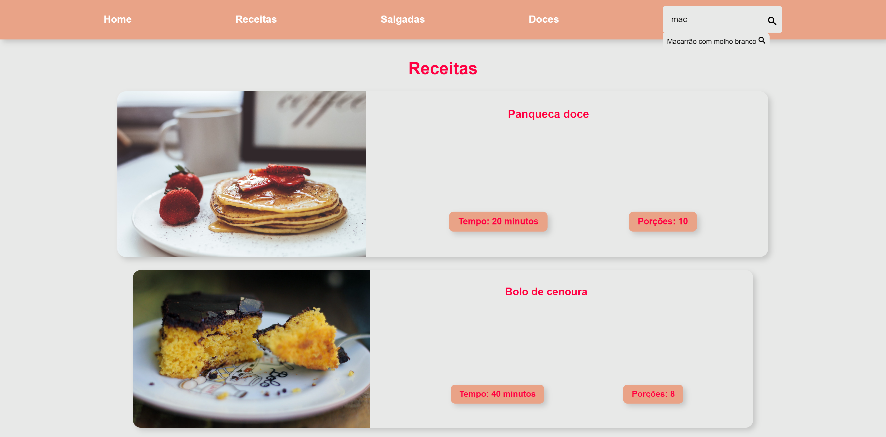
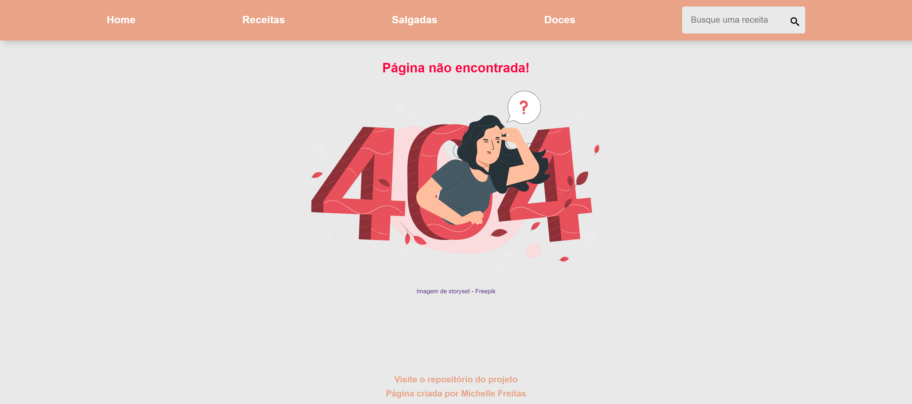

# RECEITAS

Página de receitas simples criada para estudo de React.js com uso de react-router-dom para uma aplicação com rotas para receitas, receitas doces, receitas salgadas e receita específica, com barra de pesquisa com caixa dos resultados encontrados. 

[Visite a página Delicious Receitas](https://delicius-recipes-app.netlify.app/)

### Imagem da HOME

### Imagem da parte da Lista de Receitas e barra de pesquisa

### Imagem de um exemplo de receita

### Imagem de página não encontrada

### 🚀 Tecnologias
Esse projeto foi desenvolvido com as seguintes tecnologias:

- React.js / Vite
- React Icons
- React-router-dom (v6)
- StyledComponents
- JSON
